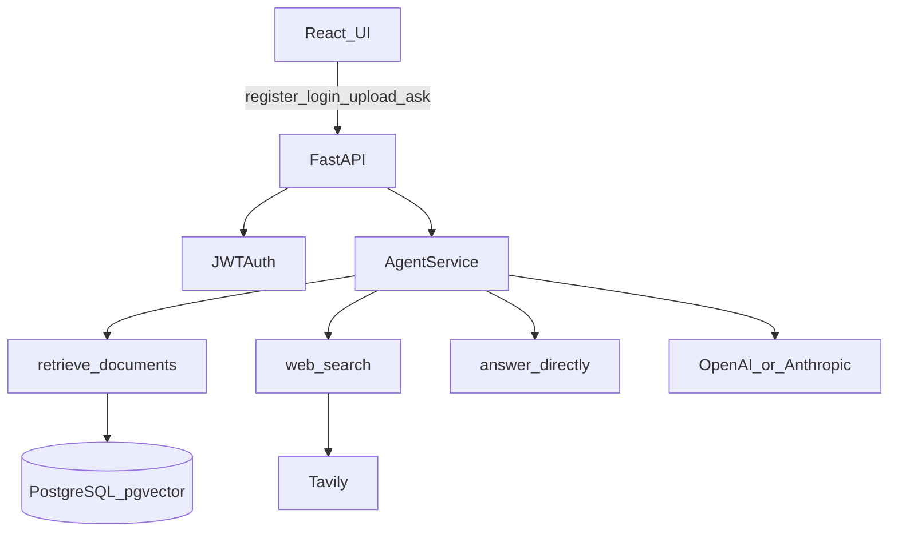

# Agentic RAG API

Upload documents and ask questions. An agent chooses between document retrieval, web search, or a direct answer, then returns a response with citations.

## Problem

Searching PDFs and notes by hand is slow, and generic chatbots invent answers. This API indexes your files, routes each question through tools, and returns answers you can verify against cited sources.

## Architecture



**Ingestion:** upload → extract text page-aware (PDF/TXT/MD) → paragraph-first overlapping chunks → embed (`text-embedding-3-small`) → store in PostgreSQL with pgvector.

**Chunking:** paragraph-aware splits driven by `CHUNK_SIZE` / `CHUNK_OVERLAP` (defaults `800` / `100`). PDF chunks keep `page_number` for citations. Re-upload existing documents after changing chunking so they pick up the new strategy.

**Retrieval:** hybrid dense (pgvector) + Postgres full-text search, fused with Reciprocal Rank Fusion (RRF), filtered by `RETRIEVAL_MIN_SCORE`, then optionally reranked with a small LLM (`RERANK_MODEL`, default `gpt-4o-mini`). When Self-RAG is enabled, the system grades evidence quality and may rewrite the query and retry retrieve (up to `SELF_RAG_MAX_RETRIES`).

**Model selection:** each query can request `auto`, `openai`, or `anthropic`. Auto mode inspects the question before the agent call, chooses a configured provider/model, and returns an explanation of the decision.

**Query:** the selected LLM calls tools as needed (`retrieve_documents`, `web_search`, `answer_directly`), then produces a final answer with citations, optional `retrieval_trace` (Self-RAG attempts), and a `route` field (`retrieve` | `web` | `direct` | `mixed`). Empty retrieve results return no document citations; the agent is instructed not to invent document content.

**UI walkthrough:** the web app shows short explainers next to upload, model choice, answers, and citations so you can see chunking, retrieval, tool routing, and grounding while you use the demo.

## Live demo

Deploy your own instance to Railway (see below) or run locally with Docker Compose. Open the root URL for the web UI, or `/docs` for OpenAPI.

> Set at least one LLM key (`OPENAI_API_KEY` or `ANTHROPIC_API_KEY`). Set `TAVILY_API_KEY` if you want web search. Uploaded files on Railway use ephemeral disk and are lost on redeploy.

## API endpoints

| Method | Path | Auth | Description |
|--------|------|------|-------------|
| GET | `/health` | No | Health check |
| POST | `/api/v1/auth/register` | No | Create account |
| POST | `/api/v1/auth/login` | No | Get JWT |
| GET | `/api/v1/models` | No | List available model choices |
| GET | `/api/v1/chats` | JWT | List chat sessions (creates one if empty) |
| POST | `/api/v1/chats` | JWT | Create a chat session |
| PATCH | `/api/v1/chats/{id}` | JWT | Rename a chat |
| DELETE | `/api/v1/chats/{id}` | JWT | Delete a chat and its documents |
| GET | `/api/v1/chats/{id}/messages` | JWT | List messages in a chat |
| DELETE | `/api/v1/chats/{id}/messages` | JWT | Clear chat message history |
| POST | `/api/v1/documents` | JWT | Upload document (requires `chat_id` form field) |
| GET | `/api/v1/documents` | JWT | List documents for a chat (`?chat_id=`) |
| GET | `/api/v1/documents/{id}/file` | JWT | Preview / download original file |
| DELETE | `/api/v1/documents/{id}` | JWT | Delete document |
| POST | `/api/v1/queries` | JWT | Ask a question (agent; requires `chat_id`) |

Interactive docs: `http://localhost:8000/docs`

Query response includes `answer`, `citations`, `tools_used`, `route`, `model_provider`, `model_name`, `model_selection_explanation`, and optional `retrieval_trace`.

Each chat owns its own documents and message history. Retrieval only searches documents attached to the `chat_id` on the query. `POST /api/v1/queries` also accepts optional `history` (prior question/answer turns); if omitted, the server loads recent turns from that chat.

Available models are exposed at `GET /api/v1/models`. The UI dropdown only shows providers whose API keys are configured.

The query endpoint is rate limited and caps question length on purpose. These limits keep a public demo from burning through LLM API credits with repeated or oversized prompts.

## Local setup

### Prerequisites

- Docker and Docker Compose
- An OpenAI API key (or Anthropic, via `LLM_PROVIDER=anthropic`)

### Steps

```bash
git clone https://github.com/mercuriorenau/Agentic-RAG-API.git
cd Agentic-RAG-API
cp .env.example .env
# Edit .env: set SECRET_KEY and at least one LLM API key
docker compose up --build -d
```

The container runs migrations on start. Verify:

```bash
curl http://localhost:8000/health
```

Open `http://localhost:8000` for the UI.

### Example usage

```bash
# Register
curl -X POST http://localhost:8000/api/v1/auth/register \
  -H "Content-Type: application/json" \
  -d '{"email":"you@example.com","password":"password123"}'

# Login
TOKEN=$(curl -s -X POST http://localhost:8000/api/v1/auth/login \
  -H "Content-Type: application/json" \
  -d '{"email":"you@example.com","password":"password123"}' | jq -r .access_token)

# Upload
curl -X POST http://localhost:8000/api/v1/documents \
  -H "Authorization: Bearer $TOKEN" \
  -F "file=@./sample.txt"

# Ask a question
curl -X POST http://localhost:8000/api/v1/queries \
  -H "Authorization: Bearer $TOKEN" \
  -H "Content-Type: application/json" \
  -d '{"question":"What does the document say about refunds?"}'
```

## Development without Docker

```bash
python -m venv .venv
source .venv/bin/activate  # Windows: .venv\Scripts\activate
pip install -r requirements.txt

# Frontend (optional for local API-only work)
cd frontend && npm install && npm run build && cd ..

# Start Postgres with pgvector locally, then:
cp .env.example .env
alembic upgrade head
uvicorn app.main:app --reload
pytest --cov=app
python -m evals.run_evals
```

For frontend hot reload against a local API:

```bash
cd frontend && npm run dev
```

Vite proxies `/api` to `http://localhost:8000`.

## Evals

Heuristic evals live in `evals/`:

- `cases.json` — questions, expected routes, keywords, and fixture names
- `fixtures/` — sample documents seeded for live runs
- `scorers.py` — retrieval relevance and answer groundedness
- `judges.py` — optional LLM-as-judge faithfulness / answer relevance
- `python -m evals.run_evals` — offline, CI-safe (uses canned samples)
- `python -m evals.run_evals --live` — seeds fixtures into Postgres, runs real retrieve (+ agent when keys allow)
- `python -m evals.run_evals --live --judge` — live path plus LLM judge scores (extra API cost)

Live mode needs `DATABASE_URL`, `OPENAI_API_KEY` (embeddings), and a running Postgres with pgvector. `--judge` also needs `OPENAI_API_KEY`.

Pytest covers the scorers under `tests/evals/`.

### Latest offline results

`python -m evals.run_evals` — **9/9 passed** (heuristic scorers on canned samples; not live retrieval).

| Case | Relevance | Groundedness | Route |
|------|-----------|--------------|-------|
| retrieve_refund | 1.0 | 0.667 | 1.0 |
| direct_greeting | 1.0 | 1.0 | 1.0 |
| web_current_event | 0.0 | 0.429 | 1.0 |
| retrieve_shipping | 1.0 | 1.0 | 1.0 |
| ungrounded_hallucination | 1.0 | 0.111 | 1.0 |
| retrieve_lexical_sku | 1.0 | 1.0 | 1.0 |
| retrieve_multi_doc | 0.75 | 0.615 | 1.0 |
| retrieve_no_relevant | 1.0 | 1.0 | 1.0 |
| retrieve_paraphrase_return_window | 1.0 | 0.571 | 1.0 |

Low relevance on `web_current_event` and low groundedness on `ungrounded_hallucination` are expected in the fixture design (web path / intentional weak grounding). Re-run the command after changing scorers or cases and refresh this table.

## RAG quality knobs

| Variable | Role | Default |
|----------|------|---------|
| `CHUNK_SIZE` / `CHUNK_OVERLAP` | Paragraph-aware chunk windows | `800` / `100` |
| `TOP_K` | Base passages for focused questions | `5` |
| `TOP_K_MAX` | Hard cap when adaptive retrieval widens the budget | `8` |
| `ADAPTIVE_TOP_K` | Raise `top_k` toward the max for broad/survey queries | `true` |
| `CANDIDATE_MULTIPLIER` | Dense/FTS pool size = `TOP_K * multiplier` | `4` |
| `RETRIEVAL_MIN_SCORE` | Drop weak matches (cosine or mapped FTS) | `0.25` |
| `RERANK_ENABLED` | LLM listwise rerank after fusion | `true` |
| `RERANK_MODEL` | Model used for rerank / Self-RAG / judge | `gpt-4o-mini` |
| `SELF_RAG_ENABLED` | Grade evidence and rewrite/retry weak retrieves | `true` |
| `SELF_RAG_MAX_RETRIES` | Extra retrieve attempts after the first | `2` |

Self-RAG and rerank add small-model calls per retrieve, so latency and cost rise slightly when enabled.

**Adaptive `top_k` (token budget):** focused questions stay near `TOP_K`. Broad prompts (“each case”, “summarize the document”, “todos los casos”) may use a higher value up to `TOP_K_MAX` (default 8). The agent still does **not** load the whole PDF — incomplete coverage on survey questions is an intentional cost limit for this demo, not a broken index. Prefer one case/section per question for fuller answers. For best demo results, keep uploads around **15 pages or fewer**; longer files work better with focused questions. After changing chunking settings, **re-upload documents** so chunks and embeddings regenerate. Older uploads keep their previous chunk boundaries.

## Environment variables

| Variable | Description | Default |
|----------|-------------|---------|
| `DATABASE_URL` | Async PostgreSQL URL | `postgresql+asyncpg://...` |
| `SECRET_KEY` | JWT signing key | — |
| `OPENAI_API_KEY` | OpenAI API key | — |
| `ANTHROPIC_API_KEY` | Anthropic API key | — |
| `TAVILY_API_KEY` | Tavily web search key | — |
| `LLM_PROVIDER` | `openai` or `anthropic` | `openai` |
| `EMBEDDING_MODEL` | Embedding model | `text-embedding-3-small` |
| `CHAT_MODEL` | OpenAI chat model | `gpt-4o` |
| `ANTHROPIC_CHAT_MODEL` | Anthropic chat model | `claude-sonnet-4-5` |
| `CHUNK_SIZE` | Characters per chunk | `800` |
| `CHUNK_OVERLAP` | Chunk overlap | `100` |
| `TOP_K` | Base chunks for focused questions | `5` |
| `TOP_K_MAX` | Hard cap for adaptive broad queries | `8` |
| `ADAPTIVE_TOP_K` | Enable adaptive top_k | `true` |
| `CANDIDATE_MULTIPLIER` | Hybrid candidate pool multiplier | `4` |
| `RETRIEVAL_MIN_SCORE` | Minimum retrieve score (0-1) | `0.25` |
| `RERANK_ENABLED` | Enable LLM rerank after hybrid fusion | `true` |
| `RERANK_MODEL` | Rerank / Self-RAG / judge chat model | `gpt-4o-mini` |
| `SELF_RAG_ENABLED` | Enable Self-RAG grade/rewrite/retry | `true` |
| `SELF_RAG_MAX_RETRIES` | Extra Self-RAG retrieve attempts | `2` |
| `AGENT_MAX_TOOL_ROUNDS` | Max tool-calling rounds | `3` |
| `MAX_QUERY_LENGTH` | Max question length in characters | `600` |
| `UPLOAD_DIR` | File storage path | `./uploads` |
| `MAX_UPLOAD_SIZE_MB` | Upload size limit | `10` |
| `STATIC_DIR` | Built frontend path | `./frontend/dist` |
| `RATE_LIMIT_AUTH` | Auth rate limit | `10/minute` |
| `RATE_LIMIT_QUERY` | Query rate limit | `3/day` |
| `LOG_LEVEL` | Log level | `INFO` |

## Railway deployment

1. Create a Railway project and add a PostgreSQL database.
2. Add this repo as a service (uses `railway.toml` + `Dockerfile`).
3. Set environment variables: `DATABASE_URL`, `SECRET_KEY`, and your LLM key(s).
4. Migrations run via `entrypoint.sh` on boot.
5. Ensure pgvector is enabled (migration runs `CREATE EXTENSION IF NOT EXISTS vector`).

## Tech stack

- FastAPI, SQLAlchemy 2 (async), Alembic, PostgreSQL + pgvector
- JWT auth (python-jose, passlib/bcrypt)
- Agentic tool calling (OpenAI or Anthropic)
- Tavily web search (optional)
- React + Vite UI served as static files
- pytest, ruff, GitHub Actions CI
- Docker Compose

## Future work

- S3-compatible file storage
- Refresh tokens
- Streaming responses
- DOCX support
