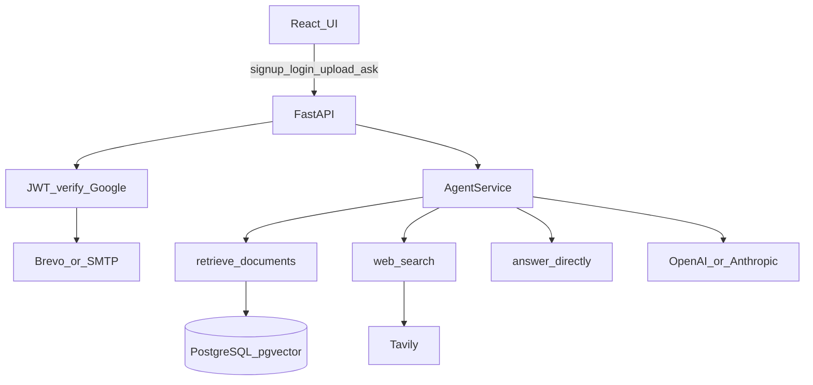

# Agentic RAG API

Upload documents into isolated chats and ask questions. An agent chooses hybrid retrieval, web search, or a direct answer, then streams a traceable reply with citations.

<!-- Add docs/demo.gif yourself (screen recording of the live UI). -->


*Demo flow: upload → ask → agent route + citations (~30–45s).*

[](https://www.python.org/)
[](https://fastapi.tiangolo.com/)
[](https://vitejs.dev/)

**[Live demo](https://mercurio-agentic-rag.up.railway.app/)** ·
**[Repository](https://github.com/mercuriorenau/Agentic-RAG-API)** ·
**[GitHub](https://github.com/mercuriorenau)** ·
**[LinkedIn](https://www.linkedin.com/in/mercuriorenau/)**

## Why this exists

This is a **personal educational demo**, not a production SaaS. The goal is to make agentic RAG visible end to end: each chat owns its files, an agent picks tools, retrieval stays capped for token cost, and the UI shows citations, routes, and dashed **i** explainers so you can inspect the pipeline while you use it.

**What you can learn by clicking around**

- How an agent decides among `retrieve_documents`, `web_search`, and `answer_directly`
- Hybrid search (dense vectors + full-text), RRF fusion, optional rerank, and Self-RAG retries
- Why survey questions get partial coverage under a hard `top_k` cap (design, not a broken index)
- Auth and ops choices that show up in a real deploy (email verify, rate limits, ephemeral disk)

## Features

**Auth**

- Email/password signup held until verification (link or 6-digit code)
- Brevo HTTPS email on Railway; optional Gmail SMTP locally
- Google OAuth (treated as verified)
- Password reset via emailed code (password unchanged until confirmed)
- JWT sessions

**Chats and documents**

- Isolated workspaces: each chat has its own documents and message history
- Upload PDF / TXT / MD; first upload can rename a default “New chat” from the filename stem
- Preview and delete per document

**Agent and RAG**

- Tool-calling agent (OpenAI and/or Anthropic)
- Hybrid retrieve → RRF → optional LLM rerank → Self-RAG grade/rewrite
- Adaptive `top_k` with a hard demo cap (`TOP_K_MAX`, default 8)
- Optional Tavily web search
- Auto model mode picks a provider from simple question heuristics

**UI transparency**

- Streaming agent steps (ops progress, not private chain-of-thought)
- Collapsible citations and retrieval trace
- Enter to send, Shift+Enter for a new line
- First-visit walkthrough; completion stored per account (`onboarded`)
- Dashed **i** notes next to upload, models, memory, citations, and budget

**Ops**

- Docker Compose locally; Railway-friendly Dockerfile + migrations on boot
- Ask rate limit per signed-in account (default `10/day`); client lock after a 429
- Question length cap; upload size cap
- Offline + optional live evals under `evals/`
- GitHub Actions CI (lint, pytest, frontend build)

## Architecture


```mermaid
flowchart TB
  UI[React_UI]
  API[FastAPI]
  Auth[JWT_verify_Google]
  Email[Brevo_or_SMTP]
  Agent[AgentService]
  Retrieve[retrieve_documents]
  Web[web_search]
  Direct[answer_directly]
  PG[(PostgreSQL_pgvector)]
  LLM[OpenAI_or_Anthropic]
  Tavily[Tavily]

  UI -->|signup_login_upload_ask| API
  API --> Auth
  Auth --> Email
  API --> Agent
  Agent --> LLM
  Agent --> Retrieve
  Agent --> Web
  Agent --> Direct
  Retrieve --> PG
  Web --> Tavily
```

**Ingestion:** upload → extract text (page numbers on PDFs when available) → overlapping paragraph chunks (`CHUNK_SIZE` / `CHUNK_OVERLAP`) → embed (`text-embedding-3-small`) → store in PostgreSQL with pgvector. Re-upload after changing chunk settings so old files pick up the new strategy.

**Retrieval:** dense (pgvector) + Postgres full-text → Reciprocal Rank Fusion → score floor → optional listwise LLM rerank → Self-RAG may grade evidence and rewrite/retry (up to `SELF_RAG_MAX_RETRIES`). Broad questions may raise `top_k` toward `TOP_K_MAX`; the agent still does not load the whole PDF.

**Query:** the selected model calls tools as needed, then returns an answer with citations, optional `retrieval_trace`, and a `route` (`retrieve` | `web` | `direct` | `mixed`). Empty retrieve means no document citations; the agent is instructed not to invent file content.

## Live demo

Open **[https://mercurio-agentic-rag.up.railway.app/](https://mercurio-agentic-rag.up.railway.app/)**.

Caveats (intentional for a public portfolio demo):

- Needs at least one LLM key on the server (`OPENAI_API_KEY` and/or `ANTHROPIC_API_KEY`); web search needs `TAVILY_API_KEY`
- Uploaded files on Railway Hobby use **ephemeral disk** and disappear on redeploy
- Default **10 Ask requests per account per day**; after a too many requests (429) response the UI also locks Ask/Upload for that account on the client
- Prefer short PDFs (~15 pages) or questions about one section at a time

## Quick start

**Prerequisites:** Docker, Docker Compose, and at least one LLM API key.

```bash
git clone https://github.com/mercuriorenau/Agentic-RAG-API.git
cd Agentic-RAG-API
cp .env.example .env
# Set SECRET_KEY, OPENAI_API_KEY and/or ANTHROPIC_API_KEY
# For email/password signup: BREVO_API_KEY + SMTP_FROM_EMAIL (verified sender)
docker compose up --build -d
```

- UI: `http://localhost:8000`
- OpenAPI: `http://localhost:8000/docs`
- Health: `curl http://localhost:8000/health`

Email/password signup needs outbound email. On Railway Hobby use **Brevo** (`BREVO_API_KEY`, `SMTP_FROM_EMAIL`). Locally you can use Gmail SMTP (`SMTP_USERNAME` / `SMTP_PASSWORD` App Password). Set `APP_PUBLIC_URL` for verification links and OAuth callbacks.

## Example usage

```bash
# Register (sends verification email)
curl -X POST http://localhost:8000/api/v1/auth/register \
  -H "Content-Type: application/json" \
  -d '{"email":"you@example.com","password":"password123"}'

# Verify with the 6-digit code from the email (returns JWT)
TOKEN=$(curl -s -X POST http://localhost:8000/api/v1/auth/verify-email \
  -H "Content-Type: application/json" \
  -d '{"email":"you@example.com","code":"123456"}' | jq -r .access_token)

# Workspace (auto-created on first list, or POST /api/v1/chats)
CHAT_ID=$(curl -s http://localhost:8000/api/v1/chats \
  -H "Authorization: Bearer $TOKEN" | jq -r '.chats[0].id')

# Upload one of your own documents
curl -X POST http://localhost:8000/api/v1/documents \
  -H "Authorization: Bearer $TOKEN" \
  -F "chat_id=$CHAT_ID" \
  -F "file=@./path/to/document.pdf"

# Ask
curl -X POST http://localhost:8000/api/v1/queries \
  -H "Authorization: Bearer $TOKEN" \
  -H "Content-Type: application/json" \
  -d '{"question":"What does the document say about refunds?","chat_id":"'"$CHAT_ID"'"}'
```

## API

| Method | Path | Auth | Description |
|--------|------|------|-------------|
| GET | `/health` | No | Health check |
| POST | `/api/v1/auth/register` | No | Start pending signup; send verify link + code |
| POST | `/api/v1/auth/login` | No | JWT (verified email required) |
| POST | `/api/v1/auth/verify-email` | No | Verify with 6-digit code (returns JWT) |
| GET | `/api/v1/auth/verify-email?token=` | No | Verify via link (redirects signed in) |
| POST | `/api/v1/auth/resend-verification` | No | Resend link + code |
| POST | `/api/v1/auth/forgot-password` | No | Send reset code |
| POST | `/api/v1/auth/reset-password` | No | Confirm code + new password (returns JWT) |
| GET | `/api/v1/auth/google` | No | Start Google OAuth |
| GET | `/api/v1/models` | No | Available model choices |
| GET | `/api/v1/chats` | JWT | List chats (creates one if empty) |
| POST | `/api/v1/chats` | JWT | Create chat |
| PATCH | `/api/v1/chats/{id}` | JWT | Rename chat |
| DELETE | `/api/v1/chats/{id}` | JWT | Delete chat and its documents |
| GET | `/api/v1/chats/{id}/messages` | JWT | List messages |
| DELETE | `/api/v1/chats/{id}/messages` | JWT | Clear message history |
| POST | `/api/v1/documents` | JWT | Upload (`chat_id` form field) |
| GET | `/api/v1/documents` | JWT | List docs (`?chat_id=`) |
| GET | `/api/v1/documents/{id}/file` | JWT | Preview / download |
| DELETE | `/api/v1/documents/{id}` | JWT | Delete document |
| POST | `/api/v1/queries` | JWT | Ask (requires `chat_id`) |
| POST | `/api/v1/queries/stream` | JWT | Ask with SSE steps + final response |
| GET | `/api/v1/auth/me` | JWT | Current user (includes `onboarded`) |
| POST | `/api/v1/auth/onboarded` | JWT | Mark first-visit tour done |

Interactive docs: `/docs`. Query responses include `answer`, `citations`, `tools_used`, `route`, `model_provider`, `model_name`, `model_selection_explanation`, and optional `retrieval_trace`. Retrieval only searches documents on the query’s `chat_id`.

## Configuration

Copy `.env.example` for the full list. Important knobs:

| Variable | Role | Default |
|----------|------|---------|
| `DATABASE_URL` | Async Postgres URL | local Compose URL |
| `SECRET_KEY` | JWT signing | change in production |
| `OPENAI_API_KEY` / `ANTHROPIC_API_KEY` | LLM providers | at least one |
| `TAVILY_API_KEY` | Web search | optional |
| `CHAT_MODEL` / `ANTHROPIC_CHAT_MODEL` | Default chat models | `gpt-4.1` / `claude-sonnet-4-5` |
| `TOP_K` / `TOP_K_MAX` | Focused vs capped survey retrieve | `5` / `8` |
| `SELF_RAG_ENABLED` / `RERANK_ENABLED` | Grade/rewrite and listwise rerank | `true` |
| `RATE_LIMIT_QUERY` | Ask budget per account | `10/day` |
| `RATE_LIMIT_BYPASS_EMAILS` | Owner emails exempt from Ask limit | empty |
| `MAX_QUERY_LENGTH` | Question character cap | `600` |
| `BREVO_API_KEY` / `SMTP_FROM_EMAIL` | Signup/reset email (Railway) | required for email auth on Hobby |
| `APP_PUBLIC_URL` | Public URL for verify links + OAuth | `http://localhost:8000` |

## Development, tests, and evals

```bash
python -m venv .venv
source .venv/bin/activate   # Windows: .venv\Scripts\activate
pip install -r requirements.txt
cd frontend && npm install && npm run build && cd ..

# Postgres with pgvector running, then:
cp .env.example .env
alembic upgrade head
uvicorn app.main:app --reload
pytest --cov=app
python -m evals.run_evals
```

Frontend hot reload (Vite proxies `/api` → `http://localhost:8000`):

```bash
cd frontend && npm run dev
```

**Evals**

| Command | What it does |
|---------|----------------|
| `python -m evals.run_evals` | Offline heuristics on canned samples (CI-safe) |
| `python -m evals.run_evals --live` | Seed fixtures, real retrieve (+ agent when keys allow) |
| `python -m evals.run_evals --live --judge` | Live path + LLM-as-judge (extra API cost) |

Scorers cover retrieval relevance, groundedness, and route match (`evals/scorers.py`). Cases and fixtures live under `evals/`.

### Latest offline results

`python -m evals.run_evals`: **9/9 passed** (heuristic scorers on canned samples; not live retrieval).

| Case | Relevance | Groundedness | Route |
|------|-----------|--------------|-------|
| retrieve_refund | 1.0 | 0.667 | 1.0 |
| direct_greeting | 1.0 | 1.0 | 1.0 |
| web_current_event | 0.0 | 0.429 | 1.0 |
| retrieve_shipping | 1.0 | 1.0 | 1.0 |
| ungrounded_hallucination | 1.0 | 0.111 | 1.0 |
| retrieve_lexical_sku | 1.0 | 1.0 | 1.0 |
| retrieve_multi_doc | 0.75 | 0.615 | 1.0 |
| retrieve_no_relevant | 1.0 | 1.0 | 1.0 |
| retrieve_paraphrase_return_window | 1.0 | 0.571 | 1.0 |

Low relevance on `web_current_event` and low groundedness on `ungrounded_hallucination` are expected by fixture design. Refresh this table after changing scorers or cases.

## Deploy (Railway)

1. Create a Railway project.
2. Add **Postgres with pgvector** (plain Postgres lacks `vector`; boot fails on `CREATE EXTENSION vector`).
3. Deploy this repo (`railway.toml` + `Dockerfile`).
4. Set on the app service: `DATABASE_URL`, `SECRET_KEY`, LLM keys, `BREVO_API_KEY` + `SMTP_FROM_EMAIL` for email auth, `APP_PUBLIC_URL` to your public domain, optional Google/Tavily keys, and `RATE_LIMIT_QUERY=10/day` for public demos.
5. Generate a public domain under Networking.
6. `entrypoint.sh` runs `alembic upgrade head` and listens on `$PORT`.

## Project structure

```text
app/                 FastAPI app, auth, RAG agent, tools, email
alembic/             Schema migrations
frontend/            React + Vite UI
evals/               Offline + live evaluation harness
tests/               Unit and integration tests
docs/demo.gif        Screen recording (add this file)
Dockerfile           Production image
docker-compose.yml   Local API + pgvector
```

## Disclaimer

Solo portfolio / learning demo. Do not upload confidential data. Fair-use rate limits and retrieval caps are intentional to keep API cost bounded. No warranty; use at your own risk.

There is no separate license file in this repo yet. Treat the code as source-available for portfolio review unless a `LICENSE` is added later.
