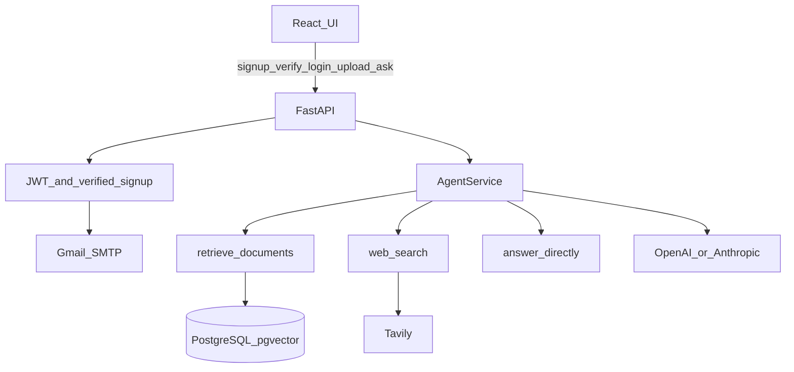

# Agentic RAG API

Upload documents into isolated chat workspaces and ask questions. An agent chooses between hybrid document retrieval, web search, or a direct answer, then streams a traceable response with citations.

## Problem

Searching PDFs and notes by hand is slow, and generic chatbots invent answers. This API indexes your files, routes each question through tools, and returns answers you can verify against cited sources.

## Architecture


```mermaid
flowchart TB
  UI[React_UI]
  API[FastAPI]
  Auth[JWT_and_verified_signup]
  Email[Gmail_SMTP]
  Agent[AgentService]
  Retrieve[retrieve_documents]
  Web[web_search]
  Direct[answer_directly]
  PG[(PostgreSQL_pgvector)]
  LLM[OpenAI_or_Anthropic]
  Tavily[Tavily]

  UI -->|signup_verify_login_upload_ask| API
  API --> Auth
  Auth --> Email
  API --> Agent
  Agent --> LLM
  Agent --> Retrieve
  Agent --> Web
  Agent --> Direct
  Retrieve --> PG
  Web --> Tavily
```

**Ingestion:** upload → extract text with page numbers when available (PDF/TXT/MD) → overlapping paragraph chunks → embed (`text-embedding-3-small`) → store in PostgreSQL with pgvector.

**Chunking:** paragraph-based splits driven by `CHUNK_SIZE` / `CHUNK_OVERLAP` (defaults `800` / `100`). PDF chunks keep `page_number` for citations. Re-upload existing documents after changing chunking so they pick up the new strategy.

**Retrieval:** hybrid dense (pgvector) + Postgres full-text search, fused with Reciprocal Rank Fusion (RRF), filtered by `RETRIEVAL_MIN_SCORE`, then optionally reranked with a small LLM (`RERANK_MODEL`, default `gpt-4o-mini`). When Self-RAG is enabled, the system grades evidence quality and may rewrite the query and retry retrieve (up to `SELF_RAG_MAX_RETRIES`).

**Model selection:** each query can request `auto`, `openai`, or `anthropic`. Auto mode inspects the question before the agent call, chooses a configured provider/model, and returns an explanation of the decision.

**Query:** the selected LLM calls tools as needed (`retrieve_documents`, `web_search`, `answer_directly`), then produces a final answer with citations, optional `retrieval_trace` (Self-RAG attempts), and a `route` field (`retrieve` | `web` | `direct` | `mixed`). Empty retrieve results return no document citations; the agent is instructed not to invent document content.

**Authentication:** Google accounts are verified immediately. Email/password signup stays in `pending_signups` until the user confirms the emailed link or 6-digit code; only then is the `users` row created. Password reset changes nothing until its emailed code is confirmed.

**UI walkthrough:** the web app shows short explainers next to upload, model choice, answers, and citations so you can see chunking, retrieval, tool routing, and grounding while you use the demo. “Agent steps” are operational progress events (model selection, tool calls, retrieval, and writing), not private chain-of-thought.

## Live demo

Deploy your own instance to Railway (see below) or run locally with Docker Compose. Open the root URL for the web UI, or `/docs` for OpenAPI.

> Set at least one LLM key (`OPENAI_API_KEY` or `ANTHROPIC_API_KEY`). Set `TAVILY_API_KEY` if you want web search. Uploaded files on Railway use ephemeral disk and are lost on redeploy.

## API endpoints

| Method | Path | Auth | Description |
|--------|------|------|-------------|
| GET | `/health` | No | Health check |
| POST | `/api/v1/auth/register` | No | Start pending signup; send verification link + code |
| POST | `/api/v1/auth/login` | No | Get JWT (requires verified email) |
| POST | `/api/v1/auth/verify-email` | No | Verify with 6-digit code (returns JWT) |
| GET | `/api/v1/auth/verify-email?token=` | No | Verify via email link (redirects signed in) |
| POST | `/api/v1/auth/resend-verification` | No | Resend link + code |
| POST | `/api/v1/auth/forgot-password` | No | Send password reset code (password unchanged until confirmed) |
| POST | `/api/v1/auth/reset-password` | No | Confirm reset code + set new password (returns JWT) |
| GET | `/api/v1/models` | No | List available model choices |
| GET | `/api/v1/chats` | JWT | List chat sessions (creates one if empty) |
| POST | `/api/v1/chats` | JWT | Create a chat session |
| PATCH | `/api/v1/chats/{id}` | JWT | Rename a chat |
| DELETE | `/api/v1/chats/{id}` | JWT | Delete a chat and its documents |
| GET | `/api/v1/chats/{id}/messages` | JWT | List messages in a chat |
| DELETE | `/api/v1/chats/{id}/messages` | JWT | Clear chat message history |
| POST | `/api/v1/documents` | JWT | Upload document (requires `chat_id` form field) |
| GET | `/api/v1/documents` | JWT | List documents for a chat (`?chat_id=`) |
| GET | `/api/v1/documents/{id}/file` | JWT | Preview / download original file |
| DELETE | `/api/v1/documents/{id}` | JWT | Delete document |
| POST | `/api/v1/queries` | JWT | Ask a question (agent; requires `chat_id`) |
| POST | `/api/v1/queries/stream` | JWT | Ask with SSE progress events and final response |

Interactive docs: `http://localhost:8000/docs`

Query response includes `answer`, `citations`, `tools_used`, `route`, `model_provider`, `model_name`, `model_selection_explanation`, and optional `retrieval_trace`.

Each chat owns its own documents and message history. Retrieval only searches documents attached to the `chat_id` on the query. `POST /api/v1/queries` also accepts optional `history` (prior question/answer turns); if omitted, the server loads recent turns from that chat.

Available models are exposed at `GET /api/v1/models`. The UI dropdown only shows providers whose API keys are configured.

The query endpoints are rate limited and cap question length on purpose. The default is 10 Ask requests per visitor IP per day. After a 429, the UI also locks Ask and Upload in that tab for up to about 24 hours (sessionStorage; closing the tab clears the lock). Uploads are not independently rate-limited by the API. Emails in `RATE_LIMIT_BYPASS_EMAILS` bypass the query limit.

## Local setup

### Prerequisites

- Docker and Docker Compose
- An OpenAI API key (or Anthropic, via `LLM_PROVIDER=anthropic`)

### Steps

```bash
git clone https://github.com/mercuriorenau/Agentic-RAG-API.git
cd Agentic-RAG-API
cp .env.example .env
# Edit .env: set SECRET_KEY, at least one LLM API key, and BREVO_API_KEY for signup
docker compose up --build -d
```

Email/password signup requires outbound email. On Railway Hobby, use **Brevo** (HTTPS API): set `BREVO_API_KEY` and `SMTP_FROM_EMAIL` (a sender you verified in Brevo). Locally you can still use Gmail SMTP with `SMTP_USERNAME` / `SMTP_PASSWORD` (App Password). Users must verify via the emailed link or 6-digit code before login. Google sign-in is treated as verified. `APP_PUBLIC_URL` is used in verification links.

The container runs migrations on start. Verify:

```bash
curl http://localhost:8000/health
```

Open `http://localhost:8000` for the UI.

### Example usage

```bash
# Register (sends verification email; check inbox for link or code)
curl -X POST http://localhost:8000/api/v1/auth/register \
  -H "Content-Type: application/json" \
  -d '{"email":"you@example.com","password":"password123"}'

# Verify with code from the email (returns JWT and signs you in)
TOKEN=$(curl -s -X POST http://localhost:8000/api/v1/auth/verify-email \
  -H "Content-Type: application/json" \
  -d '{"email":"you@example.com","code":"123456"}' | jq -r .access_token)

# Or login later with the same email/password
# TOKEN=$(curl -s -X POST http://localhost:8000/api/v1/auth/login \
#   -H "Content-Type: application/json" \
#   -d '{"email":"you@example.com","password":"password123"}' | jq -r .access_token)

# Get the auto-created workspace (or POST /api/v1/chats to make another)
CHAT_ID=$(curl -s http://localhost:8000/api/v1/chats \
  -H "Authorization: Bearer $TOKEN" | jq -r '.chats[0].id')

# Upload into that chat
curl -X POST http://localhost:8000/api/v1/documents \
  -H "Authorization: Bearer $TOKEN" \
  -F "chat_id=$CHAT_ID" \
  -F "file=@./sample.txt"

# Ask in the same chat
curl -X POST http://localhost:8000/api/v1/queries \
  -H "Authorization: Bearer $TOKEN" \
  -H "Content-Type: application/json" \
  -d '{"question":"What does the document say about refunds?","chat_id":"'"$CHAT_ID"'"}'
```

## Development without Docker

```bash
python -m venv .venv
source .venv/bin/activate  # Windows: .venv\Scripts\activate
pip install -r requirements.txt

# Frontend (optional for local API-only work)
cd frontend && npm install && npm run build && cd ..

# Start Postgres with pgvector locally, then:
cp .env.example .env
alembic upgrade head
uvicorn app.main:app --reload
pytest --cov=app
python -m evals.run_evals
```

For frontend hot reload against a local API:

```bash
cd frontend && npm run dev
```

Vite proxies `/api` to `http://localhost:8000`.

## Evals

Heuristic evals live in `evals/`:

- `cases.json`: questions, expected routes, keywords, and fixture names
- `fixtures/`: sample documents seeded for live runs
- `scorers.py`: retrieval relevance and answer groundedness
- `judges.py`: optional LLM-as-judge faithfulness / answer relevance
- `python -m evals.run_evals`: offline, CI-safe (uses canned samples)
- `python -m evals.run_evals --live`: seeds fixtures into Postgres, runs real retrieve (+ agent when keys allow)
- `python -m evals.run_evals --live --judge`: live path plus LLM judge scores (extra API cost)

Live mode needs `DATABASE_URL`, `OPENAI_API_KEY` (embeddings), and a running Postgres with pgvector. `--judge` also needs `OPENAI_API_KEY`.

Pytest covers the scorers under `tests/evals/`.

### Latest offline results

`python -m evals.run_evals`: **9/9 passed** (heuristic scorers on canned samples; not live retrieval).

| Case | Relevance | Groundedness | Route |
|------|-----------|--------------|-------|
| retrieve_refund | 1.0 | 0.667 | 1.0 |
| direct_greeting | 1.0 | 1.0 | 1.0 |
| web_current_event | 0.0 | 0.429 | 1.0 |
| retrieve_shipping | 1.0 | 1.0 | 1.0 |
| ungrounded_hallucination | 1.0 | 0.111 | 1.0 |
| retrieve_lexical_sku | 1.0 | 1.0 | 1.0 |
| retrieve_multi_doc | 0.75 | 0.615 | 1.0 |
| retrieve_no_relevant | 1.0 | 1.0 | 1.0 |
| retrieve_paraphrase_return_window | 1.0 | 0.571 | 1.0 |

Low relevance on `web_current_event` and low groundedness on `ungrounded_hallucination` are expected in the fixture design (web path / intentional weak grounding). Re-run the command after changing scorers or cases and refresh this table.

## RAG quality knobs

| Variable | Role | Default |
|----------|------|---------|
| `CHUNK_SIZE` / `CHUNK_OVERLAP` | Paragraph-aware chunk windows | `800` / `100` |
| `TOP_K` | Base passages for focused questions | `5` |
| `TOP_K_MAX` | Hard cap when adaptive retrieval widens the budget | `8` |
| `ADAPTIVE_TOP_K` | Raise `top_k` toward the max for broad/survey queries | `true` |
| `CANDIDATE_MULTIPLIER` | Dense/FTS pool size = adaptive `top_k × multiplier` (per channel) | `4` |
| `RETRIEVAL_MIN_SCORE` | Drop weak matches (cosine or mapped FTS) | `0.25` |
| `RERANK_ENABLED` | LLM listwise rerank after fusion | `true` |
| `RERANK_MODEL` | Model used for rerank / Self-RAG / judge | `gpt-4o-mini` |
| `SELF_RAG_ENABLED` | Grade evidence and rewrite/retry weak retrieves | `true` |
| `SELF_RAG_MAX_RETRIES` | Extra retrieve attempts after the first | `2` |

Self-RAG and rerank add small-model calls per retrieve, so latency and cost rise slightly when enabled.

**Adaptive `top_k` (token budget):** focused questions stay near `TOP_K`. Broad prompts (“each case”, “summarize the document”, “todos los casos”) may use a higher value up to `TOP_K_MAX` (default 8). The agent still does **not** load the whole PDF. Incomplete coverage on survey questions is an intentional cost limit for this demo, not a broken index. Prefer one case/section per question for fuller answers. For best demo results, keep uploads around **15 pages or fewer**; longer files work better with focused questions. After changing chunking settings, **re-upload documents** so chunks and embeddings regenerate. Older uploads keep their previous chunk boundaries.

## Environment variables

| Variable | Description | Default |
|----------|-------------|---------|
| `DATABASE_URL` | Async PostgreSQL URL | `postgresql+asyncpg://...` |
| `SECRET_KEY` | JWT signing key | `change-me-in-production` |
| `OPENAI_API_KEY` | OpenAI API key | at least one LLM key |
| `ANTHROPIC_API_KEY` | Anthropic API key | at least one LLM key |
| `TAVILY_API_KEY` | Tavily web search key | optional |
| `LLM_PROVIDER` | `openai` or `anthropic` | `openai` |
| `EMBEDDING_MODEL` | Embedding model | `text-embedding-3-small` |
| `CHAT_MODEL` | OpenAI chat model | `gpt-4.1` |
| `ANTHROPIC_CHAT_MODEL` | Anthropic chat model | `claude-sonnet-4-5` |
| `GOOGLE_CLIENT_ID` | Google OAuth client ID | optional |
| `GOOGLE_CLIENT_SECRET` | Google OAuth client secret | optional |
| `GOOGLE_REDIRECT_URI` | Google OAuth callback URL | `http://localhost:8000/api/v1/auth/google/callback` |
| `CHUNK_SIZE` | Characters per chunk | `800` |
| `CHUNK_OVERLAP` | Chunk overlap | `100` |
| `TOP_K` | Base chunks for focused questions | `5` |
| `TOP_K_MAX` | Hard cap for adaptive broad queries | `8` |
| `ADAPTIVE_TOP_K` | Enable adaptive top_k | `true` |
| `CANDIDATE_MULTIPLIER` | Hybrid candidate pool multiplier (applied to adaptive top_k) | `4` |
| `RETRIEVAL_MIN_SCORE` | Minimum retrieve score (0-1) | `0.25` |
| `RERANK_ENABLED` | Enable LLM rerank after hybrid fusion | `true` |
| `RERANK_MODEL` | Rerank / Self-RAG / judge chat model | `gpt-4o-mini` |
| `SELF_RAG_ENABLED` | Enable Self-RAG grade/rewrite/retry | `true` |
| `SELF_RAG_MAX_RETRIES` | Extra Self-RAG retrieve attempts | `2` |
| `AGENT_MAX_TOOL_ROUNDS` | Max tool calling rounds | `5` |
| `CONVERSATION_HISTORY_MAX_TURNS` | Recent Q&A turns supplied to follow-ups | `6` |
| `MAX_QUERY_LENGTH` | Max question length in characters | `600` |
| `UPLOAD_DIR` | File storage path | `./uploads` |
| `MAX_UPLOAD_SIZE_MB` | Upload size limit | `10` |
| `STATIC_DIR` | Built frontend path | `./frontend/dist` |
| `RATE_LIMIT_AUTH` | Auth rate limit | `10/minute` |
| `RATE_LIMIT_QUERY` | Query rate limit | `10/day` |
| `RATE_LIMIT_DISABLED` | Turn off query limits for everyone | `false` |
| `RATE_LIMIT_BYPASS_EMAILS` | Comma-separated owner emails (unlimited Ask) | |
| `BREVO_API_KEY` | Brevo transactional email API key | _(recommended on Railway)_ |
| `SMTP_FROM_EMAIL` | From address (required with Brevo; defaults to username for SMTP) | |
| `SMTP_FROM_NAME` | Display name for verification/reset email | `Agentic RAG` |
| `SMTP_USERNAME` | Gmail address for local SMTP fallback | |
| `SMTP_PASSWORD` | Gmail App Password for local SMTP fallback | |
| `EMAIL_VERIFICATION_EXPIRE_MINUTES` | Verify link/code lifetime | `10` |
| `APP_PUBLIC_URL` | Public app URL (verify links + OAuth) | `http://localhost:8000` |
| `LOG_LEVEL` | Log level | `INFO` |

## Railway deployment

1. Create a Railway project.
2. Add **Postgres with pgvector** (not plain Postgres). Railway’s default Postgres image does **not** include the `vector` extension; without it boot fails on `alembic upgrade` / `CREATE EXTENSION vector`.
3. Deploy this repo as a service (`railway.toml` + `Dockerfile`).
4. Set variables on the app service:
   - `DATABASE_URL` → reference the pgvector service’s `DATABASE_URL`
   - `SECRET_KEY`, `OPENAI_API_KEY` (and optional Anthropic/Tavily/Google keys)
   - `BREVO_API_KEY` and `SMTP_FROM_EMAIL` (verified sender in Brevo) for email/password signup on Hobby
   - Optional local SMTP fallback: `SMTP_USERNAME` / `SMTP_PASSWORD` (blocked on Railway Hobby)
   - `APP_PUBLIC_URL` → your public Railway domain (used in verification links + OAuth)
   - Prefer `RATE_LIMIT_QUERY=10/day` for public demos (keeps LLM spend bounded)
   - To use the live app yourself without the visitor cap: set `RATE_LIMIT_BYPASS_EMAILS` to your login emails, or temporarily set `RATE_LIMIT_DISABLED=true`
5. **Settings → Networking → Generate Domain** (unexposed services have no public URL).
6. Migrations run via `entrypoint.sh` on boot; the app listens on Railway’s `$PORT`.

## Tech stack

- FastAPI, SQLAlchemy 2 (async), Alembic, PostgreSQL + pgvector
- JWT auth (python-jose, passlib/bcrypt)
- Agentic tool calling (OpenAI or Anthropic)
- Tavily web search (optional)
- Brevo transactional email (HTTPS) for verification/reset, with optional Gmail SMTP fallback locally
- SlowAPI rate limiting
- React + Vite UI served as static files
- pytest, ruff, GitHub Actions CI
- Docker Compose

## Future work

- S3-compatible file storage
- Refresh tokens
- DOCX support
